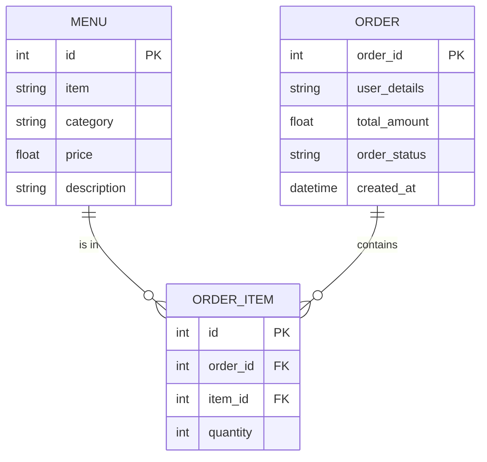
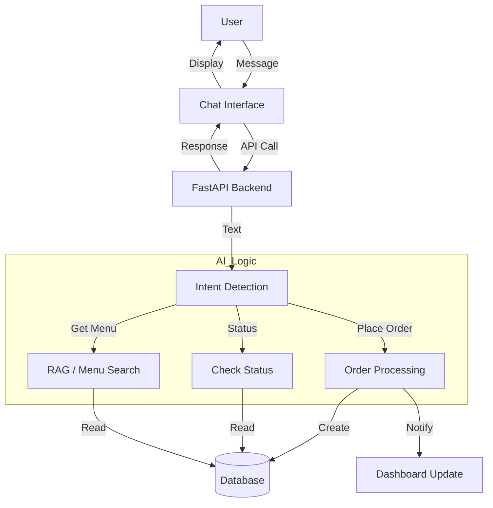

# Restaurant AI Chatbot - System Architecture

## System Overview
The system consists of three main components:
1. **Chatbot Interface**: A web-based chat interface for customers to interact with the AI.
2. **Backend API**: A FastAPI-based server that handles logic, database interactions, and AI processing.
3. **Dashboard**: A React-based admin dashboard for restaurant staff to view and manage orders.

## Entity Relationship Diagram (ERD)

## Logic Flow Diagram

## Tech Stack
- **Backend**: FastAPI
- **Database**: SQLite (MVP)
- **Frontend**: React + Vite
- **AI**: LLM Integration (Placeholder/Mock for MVP)
